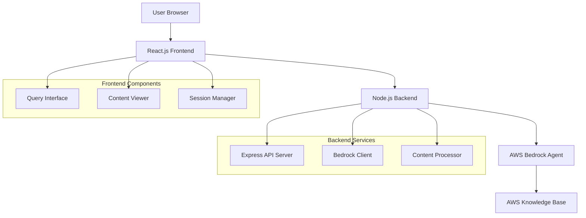

# Design Document: Multimodal Content Viewer

## Overview

The Multimodal Content Viewer is a full-stack web application built with React.js frontend and Node.js backend that integrates with AWS Bedrock Agent and Knowledge Base services. The system enables users to submit natural language queries through a web interface and receive rich, multimodal content responses that are parsed and visualized in the browser.

The architecture follows a client-server pattern with clear separation of concerns: the React frontend handles user interaction and content presentation, while the Node.js backend manages AWS service integration, authentication, and data processing.

## Architecture



### System Flow

1. User enters query in React frontend
2. Frontend sends HTTP request to Node.js backend
3. Backend authenticates and calls AWS Bedrock Agent
4. Bedrock Agent queries Knowledge Base for relevant content
5. Backend processes streaming response from Bedrock
6. Backend returns structured response to frontend
7. Frontend parses multimodal content and renders visualization

## Components and Interfaces

### Frontend Components (React.js)

#### QueryInterface Component
- **Purpose**: Handles user input and query submission
- **Props**: `onSubmit: (query: string) => void`, `loading: boolean`
- **State**: `query: string`, `inputError: string | null`
- **Methods**:
  - `handleSubmit()`: Validates and submits user query
  - `clearInput()`: Resets input field after submission
  - `validateInput()`: Ensures query meets length and content requirements

#### ContentViewer Component
- **Purpose**: Renders multimodal content responses
- **Props**: `content: MultimodalContent | null`, `loading: boolean`, `error: string | null`
- **State**: `parsedContent: ContentElement[]`, `viewMode: 'normal' | 'fullscreen'`
- **Methods**:
  - `parseContent()`: Processes raw response into renderable elements
  - `renderTextContent()`: Formats and displays text content
  - `renderImageContent()`: Handles image display with error fallbacks
  - `renderVideoContent()`: Manages video player integration
  - `handleMediaError()`: Provides fallback for failed media loading

#### SessionManager Component
- **Purpose**: Manages conversation state and session persistence
- **Props**: `onSessionChange: (sessionId: string) => void`
- **State**: `sessionId: string`, `conversationHistory: QueryResponse[]`
- **Methods**:
  - `initializeSession()`: Creates new session identifier
  - `persistSession()`: Saves session to browser storage
  - `restoreSession()`: Loads existing session from storage

### Backend Services (Node.js)

#### Express API Server
- **Purpose**: HTTP server handling client requests and responses
- **Endpoints**:
  - `POST /api/invoke-agent`: Main query processing endpoint
  - `GET /api/health`: System health check
  - `POST /api/session/new`: Create new session
  - `GET /api/session/:id`: Retrieve session information
- **Middleware**: CORS, JSON parsing, error handling, request logging

#### Bedrock Client Service
- **Purpose**: AWS Bedrock Agent integration and communication
- **Methods**:
  - `invokeAgent(query, sessionId)`: Sends query to Bedrock Agent
  - `processStreamingResponse()`: Handles real-time response processing
  - `handleAuthentication()`: Manages AWS credential validation
  - `retryWithBackoff()`: Implements retry logic for failed requests

#### Content Processor Service
- **Purpose**: Processes and structures multimodal responses
- **Methods**:
  - `parseMultimodalResponse()`: Identifies content types in response
  - `extractMediaReferences()`: Finds image, video, and document links
  - `formatTextContent()`: Applies proper text formatting and structure
  - `validateMediaUrls()`: Ensures media references are accessible

## Data Models

### TypeScript Interfaces

```typescript
interface QueryRequest {
  query: string;
  sessionId?: string;
  metadata?: Record<string, any>;
}

interface QueryResponse {
  success: boolean;
  content?: MultimodalContent;
  sessionId: string;
  error?: string;
  timestamp: Date;
}

interface MultimodalContent {
  text: TextContent[];
  images: ImageContent[];
  videos: VideoContent[];
  documents: DocumentContent[];
  metadata: ContentMetadata;
}

interface TextContent {
  content: string;
  formatting?: TextFormatting;
  position: number;
}

interface ImageContent {
  url: string;
  alt: string;
  caption?: string;
  dimensions?: { width: number; height: number };
  position: number;
}

interface VideoContent {
  url: string;
  title?: string;
  duration?: number;
  thumbnail?: string;
  position: number;
}

interface DocumentContent {
  url: string;
  title: string;
  type: 'pdf' | 'doc' | 'other';
  size?: number;
  position: number;
}

interface ContentMetadata {
  totalElements: number;
  processingTime: number;
  source: string;
  confidence?: number;
}

interface Session {
  id: string;
  createdAt: Date;
  lastActivity: Date;
  queryCount: number;
  context: Record<string, any>;
}
```

### Database Schema (Optional - for session persistence)

```sql
-- Sessions table for persistent session management
CREATE TABLE sessions (
  id VARCHAR(255) PRIMARY KEY,
  created_at TIMESTAMP DEFAULT CURRENT_TIMESTAMP,
  last_activity TIMESTAMP DEFAULT CURRENT_TIMESTAMP,
  query_count INTEGER DEFAULT 0,
  context JSON
);

-- Query history for analytics and debugging
CREATE TABLE query_history (
  id SERIAL PRIMARY KEY,
  session_id VARCHAR(255) REFERENCES sessions(id),
  query TEXT NOT NULL,
  response JSON,
  processing_time INTEGER,
  created_at TIMESTAMP DEFAULT CURRENT_TIMESTAMP
);
```

## Correctness Properties

*A property is a characteristic or behavior that should hold true across all valid executions of a system—essentially, a formal statement about what the system should do. Properties serve as the bridge between human-readable specifications and machine-verifiable correctness guarantees.*

### Property 1: Input Validation Consistency
*For any* text input to the query interface, inputs under 2000 characters should be accepted and inputs over 2000 characters should be rejected consistently
**Validates: Requirements 1.1**

### Property 2: Query Processing Performance
*For any* valid query submission, the system should send the request to Bedrock Agent within 500ms and provide user feedback within 3 seconds
**Validates: Requirements 1.2, 7.1**

### Property 3: UI State Management
*For any* query submission, the loading indicator should be displayed during processing and the input field should be cleared after successful submission
**Validates: Requirements 1.3, 1.5**

### Property 4: Error Display Consistency
*For any* failed operation, the system should display appropriate error messages that are clear and actionable
**Validates: Requirements 1.4, 5.1, 5.3**

### Property 5: AWS Integration Completeness
*For any* backend query request, the system should authenticate with AWS, include all required parameters (query and session), and process the complete streaming response
**Validates: Requirements 2.1, 2.2, 2.3**

### Property 6: Session Lifecycle Management
*For any* user session, the system should create unique session identifiers, maintain continuity across queries, and handle session recovery automatically
**Validates: Requirements 2.5, 4.1, 4.2, 4.3, 4.4**

### Property 7: Content Parsing Completeness
*For any* multimodal response, the content parser should correctly identify all media types and handle parsing failures gracefully with fallback display
**Validates: Requirements 3.1, 3.5**

### Property 8: Multimodal Content Rendering
*For any* parsed content, the frontend should render text with proper formatting, images with error handling, and videos with standard controls
**Validates: Requirements 3.2, 3.3, 3.4**

### Property 9: Error Handling Resilience
*For any* external service failure, the system should implement retry logic, log errors appropriately, and never crash or become unresponsive
**Validates: Requirements 2.4, 5.2, 5.4, 5.5**

### Property 10: Content Organization and Layout
*For any* content display, media types should be organized in logical flow with proper responsive design and appropriate empty states
**Validates: Requirements 6.1, 6.4, 6.5**

### Property 11: Performance Optimization
*For any* content with large media files, the system should implement lazy loading and serve cached responses for repeated requests
**Validates: Requirements 7.3, 7.5**

### Property 12: Session Reset Behavior
*For any* page refresh, the system should start a new session while maintaining proper session cleanup
**Validates: Requirements 4.5**

## Error Handling

### Error Categories and Responses

#### Authentication Errors
- **AWS Credential Issues**: Return 401 with configuration guidance
- **Permission Denied**: Return 403 with access requirement details
- **Token Expiration**: Automatically refresh credentials when possible

#### Network and Service Errors
- **Connection Timeout**: Implement exponential backoff retry (3 attempts)
- **Bedrock Service Unavailable**: Return 503 with retry-after header
- **Rate Limiting**: Implement queue-based request throttling

#### Content Processing Errors
- **Malformed Response**: Log error details, display raw content as fallback
- **Media Loading Failures**: Show placeholder with retry option
- **Parsing Exceptions**: Graceful degradation to text-only display

#### Client-Side Errors
- **Invalid Input**: Real-time validation with helpful error messages
- **Browser Compatibility**: Feature detection with graceful fallbacks
- **Network Connectivity**: Offline detection with retry mechanisms

### Error Recovery Strategies

```typescript
interface ErrorRecoveryStrategy {
  retryable: boolean;
  maxRetries: number;
  backoffStrategy: 'linear' | 'exponential';
  fallbackAction: 'display_error' | 'retry_with_fallback' | 'graceful_degradation';
  userNotification: boolean;
}

const errorStrategies: Record<string, ErrorRecoveryStrategy> = {
  'AWS_AUTH_ERROR': {
    retryable: false,
    maxRetries: 0,
    backoffStrategy: 'linear',
    fallbackAction: 'display_error',
    userNotification: true
  },
  'NETWORK_TIMEOUT': {
    retryable: true,
    maxRetries: 3,
    backoffStrategy: 'exponential',
    fallbackAction: 'retry_with_fallback',
    userNotification: true
  },
  'CONTENT_PARSE_ERROR': {
    retryable: false,
    maxRetries: 0,
    backoffStrategy: 'linear',
    fallbackAction: 'graceful_degradation',
    userNotification: false
  }
};
```

## Testing Strategy

### Dual Testing Approach

The system will employ both unit testing and property-based testing to ensure comprehensive coverage:

**Unit Tests**: Verify specific examples, edge cases, and error conditions
- Component rendering with specific props
- API endpoint responses with known inputs
- Error handling for specific failure scenarios
- Integration points between frontend and backend

**Property Tests**: Verify universal properties across all inputs
- Input validation across random text inputs
- Content parsing across various response formats
- Session management across different user flows
- Error resilience across simulated failure conditions

### Property-Based Testing Configuration

**Testing Framework**: Fast-check for JavaScript/TypeScript property-based testing
**Test Configuration**: Minimum 100 iterations per property test
**Test Tagging**: Each property test must reference its design document property using the format:
`// Feature: multimodal-content-viewer, Property {number}: {property_text}`

### Test Categories

#### Frontend Component Tests
- Query interface input validation and submission
- Content viewer rendering for different content types
- Session manager state persistence and recovery
- Responsive design across viewport sizes

#### Backend Service Tests
- AWS Bedrock client integration and authentication
- Content processor parsing accuracy
- API endpoint request/response handling
- Error handling and retry logic

#### Integration Tests
- End-to-end query processing flow
- Session continuity across multiple requests
- Error propagation from backend to frontend
- Performance under various load conditions

#### Property-Based Tests
- Input validation properties across random inputs
- Content parsing properties across generated responses
- Session management properties across user scenarios
- Error handling properties across simulated failures

Each property test will generate diverse inputs to validate that the universal properties hold across all valid system states and inputs.